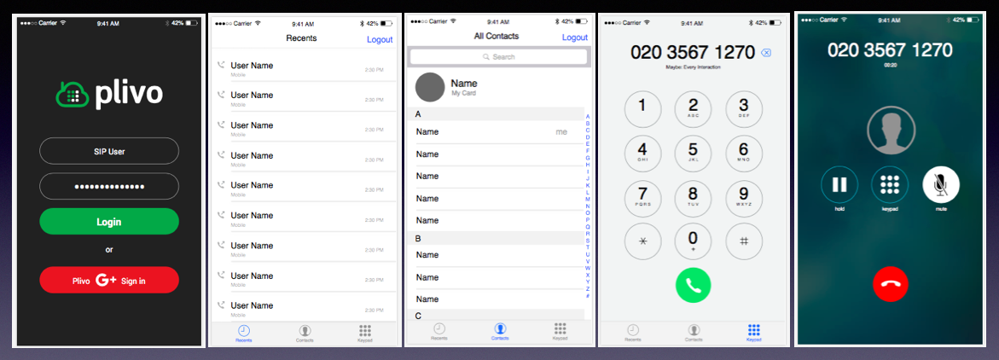
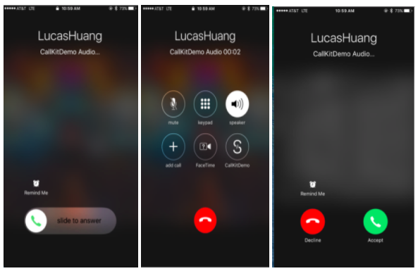

# Plivo Voice Quickstart for iOS

To get started with the quickstart application follow these steps. Steps 1-3 will enable the application to make a call. The remaining steps 4-5 will enable the application to receive incoming calls in the form of push notifications using Apple’s VoIP Service.

1. [Install the PlivoVoiceKit framework using Cocoapods](#bullet1)

2. [Create Endpoints](#bullet2)

3. [Run the app](#bullet3)

4. [Plivo iOS SDK V2 with Push Kit integration](#bullet4)

5. [Receive an incoming call](#bullet5)

### 1. Install the PlivoVoiceKit framework using Cocoapods

It's easy to install the Voice framework if you manage your dependencies using Cocoapods. Simply add the following to your Podfile:

    pod 'PlivoVoiceKit'
    
   
[Plivo Documentation](https://www.plivo.com/docs/sdk/ios/v2/reference) - More documentation related to the Voice iOS SDK

### 2. Create Endpoints

Signup and create endpoints with Plivo using below link

[Plivo Dashboard](https://manage.plivo.com/accounts/login/)

### 3. Run the app

Open `ObjCVoiceCallingApp.xcworkspace` or `SwiftVoiceCallingApp.xcworkspace`. 

Build and run the app. 

Enter sip endpoint username and password. 

After successful login make VoiceCalls. 

### 4. Plivo iOS SDK V2 with Push Kit integration

To enable Pushkit Integration in the SDK, please refer to below link on Generating VoIP Certificate. 

[Generating VoIP Certificate](https://www.plivo.com/docs/sdk/iOS/setting-up-push-credentials)

### 5. Receive an incoming call

    // MARK: PKPushRegistryDelegate
    func pushRegistry(_ registry: PKPushRegistry, didUpdate credentials: PKPushCredentials, forType type: PKPushType) {
                
        if credentials.token.count == 0 {
            print("VOIP token NULL")
            return
        }
        
        // This method is used to register the device token for VOIP push notifications.
        endpoint.registerToken(credentials.token)
    }

    //When the push arrives below delegate method will be called. 
    func pushRegistry(_ registry: PKPushRegistry, didReceiveIncomingPushWith payload: PKPushPayload, forType type: PKPushType) {
                
        if (type == PKPushType.voIP) {
            
            DispatchQueue.main.async(execute: {() -> Void in
                endpoint.relayVoipPushNotification(payload.dictionaryPayload)
            })
        }
    }
    
    PushInfo is the NSDictionary object forwarded by the apple push notification. This will enable the application to receive incoming calls even the app is not in foreground.

You are now ready to receive incoming calls. 

License

MIT
